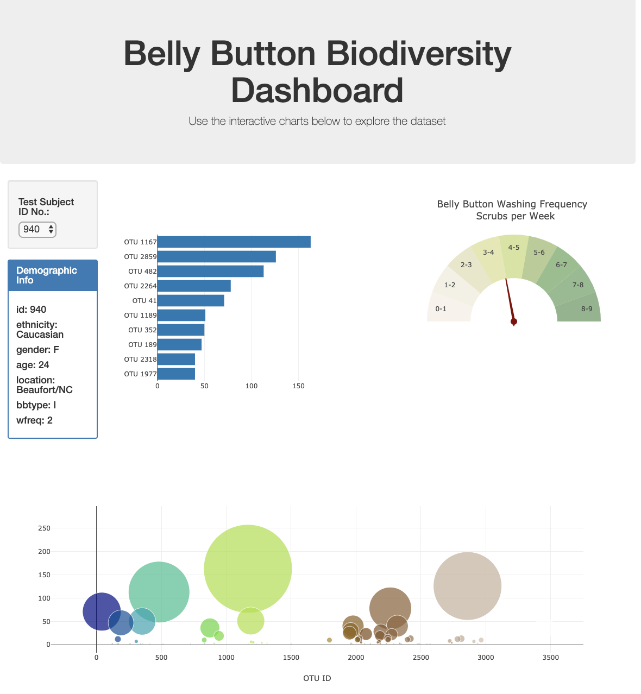

# *Plotly and Belly Button Biodiversity* 

## *Project Overview*

Rosa is a biological researcher in a micro-biology laboratory. Many bacterial species are not well studies and many more remain unknown to science. Rosa's role is to discover and document these bacteria.

In particular Rosa is interested in bacteria species that has the ability to synthesis proteins that taste like beef. Her lab has partnered with improbable beef, a good start up to research candidate species. 

Rosa has the hypothesis that there is a microorganism that can supply the next best taste and she believes it could be found quite close to home, bacteria found in the human body. 

Rosa hypothesis that the ideal bacterial species to make synthetic beef may be found in the belly button or at least in someones belly button.

To test her hypothesis Rosa has sampled the navels of people across the country to identify bacterial species that colonize the belly buttons. Each person's identity is anonymous, they have instead been assigned an id number.

Rosa wants to build a dashboard that both the research participants and her fellow researchers can access. Those who participated in the study should be able to visit the website and select their id numbers to see which bacterial species live in their navels. 

## *Resources*

* Data source: samples.json (present above).
* Javascript 
* Plotly.js library in javascript.
* Visual Studio Code.
* Web browser
* Command line interface (To start a server).

## *The Completed Dashboard*

All the code to visulize the dashboard is present above, the index.html and plots.js files. 

## * Link to the deployed page for the portfolio*

